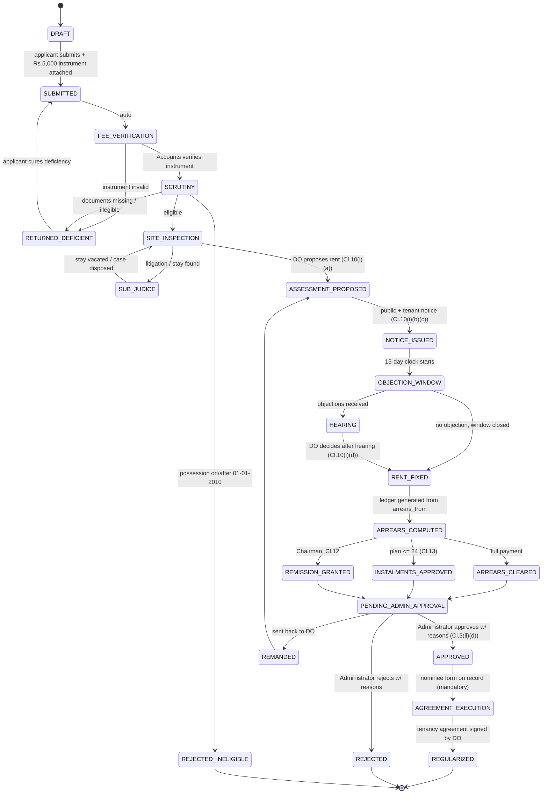

# Regularization of Possession — Master Plan

**Project:** Regularization of Possession (Urban Evacuee Trust Properties)
**Owner organisation:** Evacuee Trust Property Board (ETPB)
**Document version:** 1.1
**Date:** 19 August 2026
**Status:** In development — foundation, domain rules and intake built; see §16

---

## 0. Document Note — Source Inputs

| Source file | Size | Role in this plan |
|---|---|---|
| `lease-management-system-requirements.txt` | 2.9 KB | **Primary functional spec.** All data fields, workflow steps and report demands are drawn from here. |
| `Scheme-for-the-Management-Disposal-of-Urban-Properties-1977.pdf` | 304 KB | **Operative law.** Clause 3(ii) (Regularization of Possession), Clause 10 (Assessment), Clause 11 (Re-assessment & 8% enhancement), Clause 21 (Ejectment), Clause 22 (Penalty). |
| `Land_Reforms_Act_1977.md` | 22 KB | **Reference only.** Governs *agricultural* land ceilings (Act II of 1977). See §1.3 for why it is largely out of scope. |
| `basic requirements.txt` | **0 bytes — EMPTY** | Nothing could be read from this file. See §14 Open Questions. |

> ⚠️ **`basic requirements.txt` is an empty file (0 bytes).** This plan is therefore built entirely from the remaining three documents. If that file was meant to carry the "basic"/non-functional requirements (branding, hosting, user volumes, languages, SLAs), please populate it and this plan will be revised accordingly.

---

## 1. Executive Summary

### 1.1 What this system does

A web application that manages the **end-to-end lifecycle of an application by an unauthorised occupant of an Evacuee Trust Property to have their possession regularized** and be converted into a recorded tenant — from application intake, through documentary evidence capture, rent assessment, public objection and hearing, to Administrator approval and execution of a tenancy agreement.

### 1.2 Legal basis

Clause **3(ii) of the Scheme for the Management and Disposal of Urban Evacuee Trust Properties, 1977** (framed under Section 30 of the Evacuee Trust Properties (Management and Disposal) Act, 1975) states:

> *An existing occupant / occupants of a property whose possession has not been regularized may be treated as tenant, provided:—*
> *(a) he is in actual physical possession **prior to the 1st day of January, 2010**...*
> *(b) he clears all arrears of rent and other dues, if any, as assessed by the District Officer **from the first day of July, 2000** or from the date of actual physical occupation or date of judicial verdict or declaration by any court of law or authority **whichever is earlier**. A tenancy agreement shall be executed by the concerned District Officer with the occupant and the rent shall be fixed as per **paragraph 10**;*
> *(c) the regularization shall be made on the basis of production of **documentary evidence** or on the basis of court order, as the case may be;*
> *(d) the regularization shall be **approved by the Administrator within one month** after recording reasons.*

Every business rule in this system traces back to that clause or to the clauses it invokes. Clause **4** extends the same mechanism to pre-independence open plots later encroached upon and built up as haphazard colonies.

### 1.3 Scope note on the Land Reforms Act, 1977

`Land_Reforms_Act_1977.md` (Act II of 1977) regulates **ownership ceilings on agricultural land** — 100 acres irrigated / 200 acres un-irrigated / 8,000 Produce Index Units — resumption of excess land, compensation and Land Commissions. Its own §2(4) definition of "land" **explicitly excludes** land occupied as the site of a village, town, factory or industrial establishment, which is precisely the urban property this system deals with.

**Decision:** treat it as a *reference corpus*, not as a rule engine input. It is relevant only in the edge case where an ETP holding includes rural agricultural land (Scheme §2(i)(o) "rural agricultural land"), where the ceiling and PIU concepts may need to be recorded for information. The system will store a flag and free-text note; no ceiling calculations are implemented in Phase 1.

### 1.4 Key numbers baked into the system

| Rule | Value | Authority |
|---|---|---|
| Possession cut-off date | **on or before 31-12-2009** (i.e. prior to 01-01-2010) | Scheme 3(ii)(a) |
| Arrears start date | **01-07-2000**, or date of occupation, or date of judicial verdict — **whichever is earlier** | Scheme 3(ii)(b) |
| Assessment base date | **01-07-2006** | Scheme 10(i) |
| Objection window | **15 days** from receipt of notice | Scheme 10(i)(c) |
| Assessment completion SLA | **60 days** from first notice, extendable by Chairman | Scheme 10(i)(e) |
| Administrator approval SLA | **1 month** after recording reasons | Scheme 3(ii)(d) |
| Periodical re-assessment cycle | every **6 years** | Scheme 11(i) |
| Annual rent enhancement | **8% per annum** | Scheme 11(ii) |
| Arrears instalment cap | max **24** monthly instalments | Scheme 13 |
| Processing fee | **Rs. 5,000/-** pay order / banker's cheque / demand draft in favour of **Chairman ETPB** | Requirements spec |
| Ejectment show-cause | not less than **7 days**; vacation period max **60 days** | Scheme 21 |
| Penalty (rectifiable breach) | up to **Rs. 100,000** by District Officer | Scheme 22 |

---

## 2. Actors & Roles

| Role | Scheme reference | System capability |
|---|---|---|
| **Applicant / Occupant** | Clause 3(ii) | Self-register, file application, upload evidence, record fee instrument, track status, respond to deficiencies, view notices, download orders. |
| **District Officer (DO)** — Deputy or Assistant Administrator in charge of a district office | §2(i)(f) | Scrutinise application, verify documents, propose assessment, issue public + tenant notices, receive objections, hold hearings, **fix rent**, compute arrears, allow instalments (≤24), execute tenancy agreement, impose penalty ≤ Rs.100,000. |
| **Administrator** (Dy./Asst. Administrator) | §2(i)(a) | **Approve regularization within one month, recording reasons.** Call for record; review DO assessment. Change of tenancy where rent > Rs.10,000 ≤ Rs.20,000. |
| **Chairman, ETPB** | Scheme passim | Extend the 60-day assessment period; call for record of any property; remit/assess nominal rent for indigent, orphans, widows (Cl. 12); cancel tenancy obtained by fraud (Cl. 23); change of tenancy where rent > Rs.20,000. Consumes executive reports. |
| **Dealing Assistant / Clerk** | — | Data entry on behalf of walk-in applicants, diary/dispatch of notices, physical file linkage. |
| **Accounts / Cashier** | — | Verify the Rs.5,000 instrument with the bank, post arrears receipts, maintain the ledger. |
| **Legal Officer** | — | Maintain litigation register, restraining orders, direction cases; flag properties as *sub judice*. |
| **System Administrator** | — | Users, roles, districts/mouza masters, rate tables, conversion factors, audit review, backups. |
| **Auditor (read-only)** | — | Read-only access to everything + audit log. No mutations. |

### 2.1 Separation of duties (non-negotiable)

- The officer who **proposes** an assessment may not be the one who **approves** it.
- The officer who **verifies the fee instrument** may not be the one who **fixes the rent**.
- **No** hard deletes anywhere. Everything is soft-delete + audit trail.
- Rent, once fixed and approved, is **immutable**; corrections happen only by a new, reasoned revision record that supersedes the previous one and preserves it.

---

## 3. Technology Stack

Grounded in what is actually installed on this machine (`C:\xampp`):

| Layer | Choice | Installed version | Notes |
|---|---|---|---|
| Web server | Apache (XAMPP) | bundled | Deployment root is `C:\xampp\htdocs\proj_regular` |
| Language | **PHP 8.0.30** | ✅ present | Typed properties, union types, constructor promotion, `match`, named args all available. |
| Database | **MariaDB 10.4.32** | ✅ present | InnoDB, full transaction support, generated columns, CTEs, window functions. CHECK constraints are enforced in 10.4. |
| Front-end | Server-rendered PHP templates + **Bootstrap 5** + vanilla JS / Alpine.js | — | Avoids a build step. All assets vendored locally (offline-capable government network). |
| Charting | Chart.js (vendored) | — | For the executive dashboard. |
| PDF generation | **mPDF** or **Dompdf** | needs install | For orders, notices, tenancy agreements, and the deep report. |
| Excel export | **PhpSpreadsheet** | needs install | For the tabular rent assessment and master report. |
| Maps / Geo | **Leaflet** + OpenStreetMap tiles (or offline tile pack) | — | Geo-tagging of possession. Store WGS84 lat/lng. |
| Node | v24.19.0 | ✅ present | Optional — only if a build pipeline is later added. |
| Composer | ❌ **not installed** | — | **Action item:** install Composer, or vendor libraries manually into `back-end/vendor/`. |

### 3.1 Framework decision

**Recommendation: a thin custom MVC**, not Laravel — *unless* the runtime is upgraded.

*Rationale:* Laravel 10/11 requires PHP ≥ 8.1; the installed runtime is 8.0.30. Laravel 9 (the last PHP 8.0-compatible release) is past EOL — shipping a new government system on an EOL framework is a poor security posture. Options, in order of preference:

1. **Upgrade XAMPP to PHP 8.2/8.3 and use Laravel 11.** Best long-term: migrations, Eloquent, queues, policies, validation and Blade come free, which materially reduces the build for a workflow-heavy system like this.
2. **Stay on PHP 8.0 with a thin custom MVC** (front controller + PDO repository layer + Twig or plain PHP views). Full control, zero framework EOL risk, but roughly 30–40% more hand-written plumbing.
3. Slim 4 / CodeIgniter 4 as a middle ground.

**This plan is written framework-agnostically** — the schema, workflow and rules in §5–§9 hold under any of the three. A decision is needed before Phase 1 coding starts (see §14).

---

## 4. Repository / Folder Architecture

The existing empty folders are kept and filled out:

```
proj_regular/
├── MASTER_PLAN.md                  ← this document
├── docs/
│   ├── legal/                      ← the Act, the Scheme, SROs, Board notifications
│   ├── srs/                        ← screen-by-screen specs, wireframes
│   ├── erd/                        ← entity-relationship diagrams
│   └── sop/                        ← user manuals per role (Urdu + English)
├── database/
│   ├── migrations/                 ← 001_create_users.sql, 002_... (ordered, idempotent)
│   ├── seeds/                      ← provinces, districts, tehsils, doc types, rate sources
│   ├── views/                      ← reporting views
│   ├── procedures/                 ← arrears computation, rent projection
│   └── schema.sql                  ← full consolidated DDL
├── back-end/
│   ├── public/                     ← DOCUMENT ROOT — index.php only + .htaccess
│   ├── app/
│   │   ├── Controllers/
│   │   ├── Models/
│   │   ├── Services/               ← RentAssessmentService, AreaConversionService,
│   │   │                             ArrearsService, WorkflowService, NotificationService
│   │   ├── Repositories/
│   │   ├── Policies/               ← role/permission gates
│   │   ├── Validators/             ← CNIC, dates, area, instrument
│   │   ├── Reports/
│   │   └── Support/
│   ├── config/                     ← db.php, app.php, rules.php (all §1.4 constants)
│   ├── storage/
│   │   ├── uploads/                ← OUTSIDE document root; served via a gated controller
│   │   ├── generated/              ← PDFs, exports
│   │   ├── logs/
│   │   └── backups/
│   ├── vendor/                     ← Composer or manually vendored libs
│   └── tests/
└── front-end/
    ├── assets/{css,js,img,fonts}
    ├── vendor/                     ← bootstrap, chart.js, leaflet — vendored, no CDN
    └── views/
        ├── layouts/
        ├── applicant/
        ├── district-officer/
        ├── administrator/
        ├── chairman/
        └── reports/
```

**Critical security rule:** Apache's `DocumentRoot` / the vhost must point at `back-end/public/`. Uploaded evidence must **never** be directly reachable by URL — it is served through an authenticated controller that checks role and application ownership before streaming the file.

---

## 5. Domain Rules Engine

### 5.1 Area conversion (Pakistani land measurement → square feet)

The applicant may enter area as **sqft, square yards (gaz), marla, kanal, acre, or a compound expression** (e.g. "2 Kanal 7 Marla 3 Sarsai"). The system canonicalises everything to **square feet** stored as `DECIMAL(18,4)`.

**Revenue (legal) standard — the default:**

| Unit | In square feet | Relation |
|---|---:|---|
| 1 Sarsai | 30.25 | 1/9 Marla |
| 1 Marla | **272.25** | 9 Sarsai |
| 1 Kanal | **5,445** | 20 Marla |
| 1 Acre (Killa) | **43,560** | 8 Kanal |
| 1 Murabba | 1,089,000 | 25 Acres |
| 1 Square yard (gaz) | 9 | — |

**Urban / housing-society standard — selectable:**

| Unit | In square feet |
|---|---:|
| 1 Marla | **225** (= 25 sq yd) |
| 1 Kanal | 4,500 (= 20 × 225) |

> ⚠️ **Design decision — this matters financially.** A Marla is 272.25 sqft under the revenue system but 225 sqft in most urban housing schemes — a **21% difference** that flows straight into any per-sqft rent computation. The conversion factor set is therefore **not hard-coded**: it lives in a `unit_conversion_profiles` table, is selected per district (or per application, with a reason), and the **profile used is stamped onto every application record** so historic assessments never silently change when a factor is edited.

Implementation: `AreaConversionService::toSqft(array $components, int $profileId): string` — uses BCMath / string decimals, never floats, to avoid rounding drift in money-adjacent maths.

### 5.2 Possession eligibility

```
eligible  ⟺  date_of_possession <= 2009-12-31
```

Anything on or after 01-01-2010 is rejected at intake with an explicit citation of Clause 3(ii)(a) — unless the Board has notified a later date, which the system supports via a `possession_cutoff_date` setting with an effective-from history (the clause itself says *"or from such date... as shall be determined and notified by the Board from time to time"*).

### 5.3 Arrears start date

```
arrears_from = MIN( 2000-07-01,
                    date_of_actual_physical_occupation,
                    date_of_judicial_verdict_or_declaration )
```

Per Clause 3(ii)(b), *"whichever is earlier."* The system computes this, shows all three candidate dates side by side, and records which one governed.

### 5.4 Rent assessment (Clause 10)

The DO fixes rent *"keeping in view the market rent and rent of other properties in the vicinity in similar circumstances."* The system captures each **evidence-of-value input** as a separate row so the determination is defensible:

| Rate source | Captured as |
|---|---|
| FBR notified valuation | rate/sqft or /marla, notification no., date, effective period |
| DC (District Collector) rate | ditto |
| NESPAK / registered valuator | report no., valuator name, licence no., date |
| Prevailing market rent of adjoining properties | free rows: property description, area, rent, source of information |
| **Rate determined by the District Officer** | the operative figure + written reasons (mandatory) |

The DO's determined rate is the one that flows into the ledger. The others are supporting record.

### 5.5 Rent schedule & 8% enhancement (Clause 11)

Clause 11(ii) prescribes enhancement at **8% per annum**. Two compounding interpretations exist and the difference is large over 25 years:

- **Simple:** `rent(y) = base × (1 + 0.08 × yearsElapsed)`
- **Compound:** `rent(y) = base × 1.08 ^ yearsElapsed` — over 24 years this is roughly **6.34×** the base versus about 2.92× simple.

**The system implements compounding as a configurable policy** (`rent_enhancement_method` = `SIMPLE` | `COMPOUND`, default `COMPOUND`), applied from the assessment base date, with the chosen method stamped on each generated schedule. **This requires a written policy ruling from ETPB before go-live** (see §14).

Re-assessment blocks are generated every **6 years** per Clause 11(i), with 8% p.a. applied within each block.

> ⚠️ **Conflict to resolve.** The requirements file asks for the assessment table at **4-year** intervals — *2000, 2004, 2008, 2012, 2016, 2020, 2024* — while Clause 11(i) prescribes a **6-year** re-assessment cycle and Clause 10(i) sets the base at **01-07-2006**. The system will therefore:
> - compute an **internal year-by-year ledger** (the legally correct basis for arrears), and
> - **present** it in whatever milestone columns are configured — defaulting to the requested 2000/2004/…/2024 grid — as a *view* over the yearly ledger.
>
> This satisfies the report format without corrupting the legal computation. The milestone list is a setting.

### 5.6 Arrears ledger

For each year from `arrears_from` to the current date: `rent_due`, months applicable, `amount_due`, `amount_paid`, `balance`, `remission (Cl. 12)`, `instalment plan (Cl. 13, ≤ 24)`. The closing balance is the amount the applicant must clear under Clause 3(ii)(b) before regularization can be approved. **The workflow blocks Administrator approval while the balance is non-zero and no approved instalment plan exists.**

### 5.7 Litigation gate

If the property is `pending_before_court = true`, or a `restraining_order` is active, the application **cannot** proceed past DO assessment. It parks in `SUB_JUDICE` with the case particulars, next hearing date and the order text, and reactivates only on a recorded court disposal or vacation of stay.

---

## 6. Database Design

MariaDB 10.4 / InnoDB / `utf8mb4_unicode_ci`. Every table carries `created_at`, `created_by`, `updated_at`, `updated_by`, `deleted_at` (soft delete).

### 6.1 Table inventory

**Identity & access**

| Table | Purpose |
|---|---|
| `users` | login, hashed password, CNIC, status, office_id, force_password_change, 2FA secret |
| `roles`, `permissions`, `role_permission`, `user_role` | RBAC |
| `user_sessions` | active sessions, IP, user-agent, last_seen |
| `login_attempts` | throttling / lockout |

**Geography & organisation masters**

| Table | Purpose |
|---|---|
| `provinces` → `divisions` → `districts` → `tehsils` → `mouzas` | Cascading location hierarchy. `mouzas` also carries Hadbast no. |
| `offices` | ETPB district / zonal offices; maps a DO to a jurisdiction |

**Applicant & application core**

| Table | Purpose |
|---|---|
| `applicants` | name, parentage (father/husband), address, **CNIC (13-digit, uniqueness-checked)**, contact, email, photo, thumb impression |
| `applications` | `application_no` (auto, per-district, per-year), applicant_id, property_id, status, current_stage, submitted_at, DO/Admin assignees, `unit_profile_id`, SLA clocks |
| `application_status_history` | every transition: from → to, actor, timestamp, remarks, IP |

**Property**

| Table | Purpose |
|---|---|
| `properties` | property_no, sub_unit_no (nullable), property_type (house/shop/building/plot/agri land — per Scheme §2(i)(m)), usage (residential/commercial/res-cum-comm), address, mouza/tehsil/district/province, khewat/khatooni/khasra no. |
| `property_areas` | raw entered value + unit + compound components, `area_sqft` canonical, `unit_profile_id`, conversion audit |
| `property_geo_tags` | latitude, longitude, accuracy, captured_at, captured_by, optional polygon (JSON), source (GPS/manual/satellite) |
| `possession_details` | date_of_possession, nature of possession, date_of_judicial_verdict, `arrears_from` (computed), eligibility_flag, eligibility_reason |

**Evidence**

| Table | Purpose |
|---|---|
| `document_types` | seeded master (see §6.2) with `is_certified_copy_required`, `is_mandatory` |
| `application_documents` | application_id, document_type_id, title, file_path, mime, size, sha256, is_certified_copy, issuing_authority, document_date, reference_no, verified_by, verified_at, verification_remarks |
| `document_verifications` | verification history (a document can be queried and re-verified) |

**Fee & money**

| Table | Purpose |
|---|---|
| `fee_payments` | instrument_type (PAY_ORDER / BANKERS_CHEQUE / DEMAND_DRAFT), instrument_no, instrument_date, **amount (default 5000.00)**, bank_name, branch_name, branch_code, district, payee (`Chairman ETPB`), depositor name/CNIC/contact, submitted_at, scan_file, verified_by, verified_at, bank_confirmation_ref, status |
| `arrears_ledger` | application_id, period_year, period_from, period_to, monthly_rent, months, amount_due, amount_paid, remission_amount, balance |
| `payment_receipts` | receipts posted against the ledger |
| `instalment_plans` | ≤ 24 instalments (Cl. 13), approved_by, schedule |
| `remissions` | Cl. 12 — ground (indigent/orphan/widow/other), amount or nominal rent, approved by Chairman, reasons |

**Rent assessment**

| Table | Purpose |
|---|---|
| `rate_sources` | seeded: FBR, DC_RATE, NESPAK, VALUATOR, MARKET_ADJOINING, DO_DETERMINED |
| `assessment_rounds` | application_id (or property_id), round_no, effective_from, base_date, method (SIMPLE/COMPOUND), enhancement_rate (8.00), status, DO id, notice dates, 60-day deadline, extension_by_chairman |
| `assessment_rate_inputs` | round_id, rate_source_id, rate_value, rate_unit (per sqft / per marla / per month), notification_no, notification_date, valuator/report details, remarks, attachment |
| `assessment_comparables` | adjoining-property evidence rows: description, area, rent, tenure, distance, source |
| `rent_schedule` | round_id, year, period_from, period_to, monthly_rent, annual_rent, enhancement_applied, is_reassessment_year |
| `assessment_decisions` | round_id, determined_monthly_rent, reasons (long text, **mandatory**), decided_by (DO), decided_at |
| `assessment_milestone_config` | the 2000/2004/…/2024 presentation grid |

**Objections & hearings (Clause 10(i)(b)–(d))**

| Table | Purpose |
|---|---|
| `public_notices` | round_id, notice_type (PUBLIC / TENANT / SHOW_CAUSE), issued_on, mode of service, published_at, newspaper/notice-board ref, objection_deadline (issued + 15 days), attachment |
| `objections` | notice_id, objector name, parentage, CNIC, address, contact, relationship to property, **plea (full text)**, filed_on, is_within_time, attachments |
| `hearings` | application_id/round_id, scheduled_for, venue, presiding officer, parties summoned, attendance, proceedings text, adjourned_to |
| `objection_decisions` | objection_id, decision (ACCEPTED / REJECTED / PARTIALLY_ACCEPTED), reasons, decided_by, decided_at |

**Competing occupants**

| Table | Purpose |
|---|---|
| `occupant_offers` | application_id, occupant name, CNIC, contact, portion occupied, area, **rent offered**, offer_date, terms, supporting docs, status |

**Litigation**

| Table | Purpose |
|---|---|
| `litigations` | application_id/property_id, court name, case_no, case_title, case_type, filed_on, parties, **is_pending**, **has_restraining_order**, restraining_order_date/text, **is_direction_case**, direction summary, next_hearing, last_order, disposal_date, outcome, attachments |

**Approval & outcome**

| Table | Purpose |
|---|---|
| `approvals` | application_id, level (DO / ADMINISTRATOR / CHAIRMAN), action (APPROVE / REJECT / RETURN / DEFER), **reasons (mandatory — Cl. 3(ii)(d) requires recorded reasons)**, acted_by, acted_at, due_by (Admin = decision + 1 month) |
| `nominees` | Nomination Form per Scheme para 3 — nominee name, relation, CNIC, share, legal heirs list, form scan. **Blocking:** *"the District Officer shall not transfer the tenancy or regularize the possession unless he has obtained the aforesaid nominee form."* |
| `tenancy_agreements` | application_id, agreement_no, executed_on, executed_by (DO), tenant_id, monthly_rent, security amount, terms, stamp paper details, signed scan, status |
| `regularization_orders` | order_no, order_date, issued_by, order_text, PDF path |

**Enforcement (Chapter VII)**

| Table | Purpose |
|---|---|
| `penalties` | Cl. 22 — breach description, rectifiable flag, amount (≤ 100,000 by DO), show-cause ref, hearing ref, order, status |
| `ejectment_proceedings` | Cl. 21 — show-cause issued (≥7 days), cause shown, hearing, ejectment order, vacation period (≤60 days), execution status |

**System**

| Table | Purpose |
|---|---|
| `settings` | keyed config with effective-from history (cut-off date, fee amount, enhancement rate & method, milestone years) |
| `unit_conversion_profiles`, `unit_conversion_factors` | §5.1 |
| `audit_log` | table, row id, action, **old JSON**, **new JSON**, user, IP, user-agent, timestamp — append-only |
| `notifications` | in-app + SMS/email queue, delivery status |
| `attachments` | polymorphic file store with sha256 dedupe |
| `report_snapshots` | frozen report outputs with the parameters used, so a report can be re-produced identically later |

### 6.2 `document_types` seed (from the requirements spec)

| Code | Name | Certified copy | Typically mandatory |
|---|---|---|---|
| `JAMABANDI` | Jamabandi (Record of Rights) | ✅ | ✅ |
| `MUTATION` | Mutation (Intiqal) | ✅ | ✅ |
| `KHASRA_GIRDAWARI` | Khasra Girdawari | ✅ | ✅ |
| `GEO_TAG` | GEO Tagging / Geo coordinates | — | ✅ |
| `BUILDING_PLAN` | Approved Building Plan | ✅ | conditional |
| `LOCATION_PLAN` | Location Plan / Site Plan | — | ✅ |
| `SATELLITE_IMAGERY` | Satellite Imagery | — | optional |
| `BILL_ELECTRICITY` | Electricity Bill | — | ✅ (date evidence) |
| `BILL_GAS` | SNGPL / SSGC Bill | — | optional |
| `BILL_WASA` | WASA / Water Bill | — | optional |
| `COURT_ORDER` | Court Order / Judicial Declaration | ✅ | conditional |
| `AFFIDAVIT_POSSESSION` | Affidavit re: date of possession **and nominee** | ✅ | ✅ |
| `CNIC_COPY` | CNIC copy | — | ✅ |
| `NOMINATION_FORM` | Nomination Form (Scheme para 3) | — | ✅ *(blocks regularization)* |
| `FEE_INSTRUMENT` | Rs. 5,000 pay order / DD / banker's cheque | — | ✅ |
| `OTHER` | Any other supporting document | — | — |

Mandatory-ness is **data, not code** — it is per-document-type and overridable per district, because Clause 3(ii)(c) allows regularization *"on the basis of documentary evidence **or** on the basis of court order, as the case may be"* — a court order can substitute for the ordinary evidence bundle.

### 6.3 Key constraints

- `applicants.cnic` — `CHAR(13)`, digits only, validated against the 13-digit NADRA format, indexed.
- `applications.application_no` — `UNIQUE`, format `ETPB/{DISTRICT}/ROP/{YYYY}/{SEQ}`.
- `properties (property_no, sub_unit_no, district_id)` — `UNIQUE` where not soft-deleted, to prevent two live regularizations of the same sub-unit.
- All money — `DECIMAL(15,2)`. All areas — `DECIMAL(18,4)`. **Never `FLOAT`.**
- All FKs `ON DELETE RESTRICT` (soft deletes only).
- `CHECK (date_of_possession <= '2009-12-31')` is deliberately **not** a DB constraint — it is an application rule, because the Board may notify a later date.

---

## 7. Application Workflow (State Machine)



### 7.1 Guards enforced by `WorkflowService`

| Transition | Guard |
|---|---|
| `SUBMITTED` | Rs.5,000 instrument recorded; all mandatory doc types present |
| `SCRUTINY → SITE_INSPECTION` | `date_of_possession ≤ 2009-12-31` |
| `NOTICE_ISSUED → RENT_FIXED` | 15 days elapsed **or** all objections decided |
| `RENT_FIXED` | DO's written reasons non-empty; determined rate present |
| `→ PENDING_ADMIN_APPROVAL` | arrears balance = 0 **or** approved instalment plan **or** Chairman remission |
| `→ PENDING_ADMIN_APPROVAL` | no active litigation / restraining order |
| `APPROVED → AGREEMENT_EXECUTION` | **nomination form on record** (Scheme para 3(iii)(B) proviso) |
| any approval | `reasons` mandatory, minimum length enforced |

### 7.2 SLA clocks (visible on every dashboard)

- **60 days** — first notice → assessment complete (Cl. 10(i)(e)); amber at 45, red at 60; extendable only by a recorded Chairman order.
- **15 days** — objection window per notice.
- **1 month** — DO decision → Administrator approval (Cl. 3(ii)(d)); the single most-breached statutory deadline, so it gets its own dashboard tile and an escalation email at day 21.

---

## 8. Module Breakdown (build units)

| # | Module | Key screens | Depends on |
|---|---|---|---|
| M1 | **Auth & RBAC** | login, 2FA, forgot password, user CRUD, role/permission matrix, session list | — |
| M2 | **Masters** | province/division/district/tehsil/mouza, offices, document types, rate sources, unit profiles, settings | M1 |
| M3 | **Applicant portal** | register, profile, new application wizard, my applications, deficiency response, notice inbox, download orders | M1, M2 |
| M4 | **Application intake** | applicant details, property details, **area calculator**, possession details, location, evidence upload with per-type checklist | M2, M3 |
| M5 | **Fee management** | instrument entry, bank verification, receipt printing, fee register | M4 |
| M6 | **Document verification** | verification queue, side-by-side viewer, mark verified/deficient, query trail | M4 |
| M7 | **Geo-tagging** | Leaflet map picker, coordinate entry, polygon draw, satellite overlay, distance-to-comparables | M4 |
| M8 | **Rent assessment** | rate input grid (FBR/DC/NESPAK/market), comparables table, DO determination with reasons, **year-wise schedule generator**, milestone table (2000…2024) | M4, M2 |
| M9 | **Notice & objection** | notice generator + PDF, service register, objection entry, objection register, within-time flag | M8 |
| M10 | **Hearing** | cause list, hearing scheduler, attendance, proceedings recorder, objection decisions | M9 |
| M11 | **Arrears & ledger** | ledger generation, receipts, instalment plan (≤24), remission (Cl.12), outstanding statement | M8, M5 |
| M12 | **Occupant offers** | competing-occupant register, offered rent table, comparison view | M4 |
| M13 | **Litigation** | case register, restraining orders, direction cases, hearing diary, sub-judice gate | M4 |
| M14 | **Approvals** | DO decision, Administrator approval with reasons + 1-month clock, Chairman powers, remand | M8–M13 |
| M15 | **Nominee & agreement** | nomination form capture, legal heirs, tenancy agreement generator, execution & scan upload | M14 |
| M16 | **Enforcement** | penalty (≤Rs.100,000), show-cause, ejectment proceedings (Cl.21) | M14 |
| M17 | **Reports** | see §9 | all |
| M18 | **Dashboards** | role-specific: applicant, DO, Administrator, Chairman | all |
| M19 | **Notifications** | in-app, email, SMS (deadline, deficiency, hearing, approval) | M1 |
| M20 | **Audit & admin** | audit log viewer, backup/restore, data export, system health | all |

---

## 9. Reporting

The requirements file asks for two distinct things: a **"consolidated / master report / executive for higher authorities"** and a **"deep report / each and every element should be included in the report."**

### 9.1 Executive / Master Report (for Chairman, Administrators, Ministry)

One or two pages, heavily aggregated:

- Applications received / disposed / pending, by district and by stage
- Regularizations approved, area regularized (sqft / kanal), rent secured (monthly and annualised)
- **Arrears assessed vs. recovered vs. outstanding**, with ageing buckets
- Fee collections (count × Rs.5,000, reconciled against bank)
- Cases breaching the 60-day and 1-month statutory SLAs, **named by officer**
- Sub-judice inventory; restraining orders in force
- Objections received / upheld / rejected
- Trend charts: monthly intake and disposal; district league table

### 9.2 Deep Report (per application — the complete case file)

A single generated PDF reproducing **every** captured element, in order:

1. Cover — application no., property, applicant, current status, QR code to the digital file
2. Applicant particulars — name, parentage, address, CNIC, contact, photo
3. Property particulars — property/sub-unit no., type, usage, revenue identifiers
4. **Area** — as entered (each unit), the conversion profile used, the factors applied, and the resulting sqft, shown as a worked calculation
5. Location — mouza, city, tehsil, district, province, plus geo-coordinates and a map plate
6. Possession — date claimed, evidence relied on, computed `arrears_from` with the three candidate dates
7. **Evidence schedule** — every document: type, reference, date, issuing authority, certified-copy status, verifier, verification remarks, thumbnail
8. **Rent assessment** — every rate input (FBR / DC / NESPAK / market comparables), the DO's determined rate **and full recorded reasons**
9. **Year-wise rent table** — the milestone grid (2000, 2004, 2008, 2012, 2016, 2020, 2024) plus the full annual ledger as an annexure
10. Objections — every objector's particulars and plea verbatim, and the decision on each
11. Hearing proceedings
12. Rent offered by other/illegal occupants (tabular)
13. Litigation status — pending cases, restraining orders, direction cases
14. Fee — instrument details, bank, branch code, verification
15. Arrears — ledger, payments, instalments, remissions, closing balance
16. Nominee and legal heirs
17. Approvals — DO decision, **Administrator approval with recorded reasons**, dates against statutory deadlines
18. Tenancy agreement particulars
19. **Complete audit trail** — every action, actor, timestamp
20. Annexures — scanned documents appended in full

### 9.3 Operational registers (all exportable to Excel/PDF)

Application register · Fee register · Notice & service register · Objection register · Hearing cause list · Arrears outstanding statement · Regularization register · Tenancy agreement register · Penalty & ejectment register · Sub-judice register.

---

## 10. Security & Compliance

| Area | Control |
|---|---|
| Passwords | `password_hash()` with `PASSWORD_ARGON2ID` (or bcrypt cost 12); forced change on first login; history of last 5 |
| Sessions | HttpOnly + Secure + SameSite=Strict cookies; regenerate on privilege change; idle timeout 20 min; concurrent-session control for officers |
| 2FA | TOTP mandatory for DO / Administrator / Chairman |
| SQL | **PDO prepared statements only.** No string-concatenated SQL anywhere. |
| XSS | Output escaping by default in the view layer; CSP header; no inline event handlers |
| CSRF | Per-session token on every state-changing request |
| Uploads | Whitelist (pdf/jpg/png/tiff); verify magic bytes, not just the extension; re-encode images; max 10 MB; store outside web root with random filenames; **sha256 stored** so tampering is detectable |
| File access | Every download passes an authorisation gate; downloads are themselves audited |
| Rate limiting | Login, OTP, search, and report generation |
| Audit | Append-only `audit_log` with old/new JSON; no UI path to delete or edit it |
| Backups | Nightly `mysqldump` + weekly full file backup; **restore drill documented and rehearsed quarterly** |
| PII | CNIC masked (`42101-XXXXX-X`) except to the officer handling the case and to auditors; full CNIC view is itself audited |
| Transport | HTTPS enforced; HSTS. **XAMPP's default self-signed certificate must be replaced before go-live.** |
| Hardening | Disable directory listing, remove phpMyAdmin from the production host or bind it to localhost, set a MariaDB root password, disable `display_errors` in production |

---

## 11. Non-Functional Requirements

| Dimension | Target |
|---|---|
| Concurrent users | 200 (assumption — pending §14) |
| Applications/year | 50,000 (assumption) |
| Page response | < 2 s at p95 |
| Report generation | < 30 s for the deep report; async queue for bulk exports |
| Availability | 99% during office hours |
| Browsers | Chrome/Edge current − 2, Firefox ESR |
| Devices | Desktop-first for officers; **mobile-responsive for the applicant portal and geo-tagging** (field capture) |
| Language | English UI in Phase 1; **Urdu (RTL) in Phase 2** — build with an i18n string table from day one, not retrofitted |
| Accessibility | WCAG 2.1 AA on the applicant portal |
| Retention | Permanent — these are land records; no purge policy |

---

## 12. Delivery Roadmap

| Phase | Scope | Modules | Est. duration |
|---|---|---|---|
| **P0 — Foundation** | Stack decision, Composer, repo scaffold, DB schema + migrations, seeds, auth, RBAC, audit, masters | M1, M2, M20 | 3 weeks |
| **P1 — Intake** | Applicant portal, application wizard, area calculator, evidence upload, fee entry & verification, document verification | M3–M6 | 4 weeks |
| **P2 — Assessment core** | Geo-tagging, rate inputs, DO determination, rent schedule + 8% engine, milestone grid, arrears ledger | M7, M8, M11 | 5 weeks |
| **P3 — Due process** | Notices, objection register, hearings, objection decisions, occupant offers, litigation register | M9, M10, M12, M13 | 4 weeks |
| **P4 — Approval & outcome** | DO/Administrator/Chairman approvals, SLA clocks, nominee form, tenancy agreement, regularization order | M14, M15 | 3 weeks |
| **P5 — Reporting** | Executive report, deep report, all registers, dashboards, notifications | M17, M18, M19 | 4 weeks |
| **P6 — Enforcement & hardening** | Penalties, ejectment, security review, load test, backup/restore drill, UAT fixes | M16 | 3 weeks |
| **P7 — Rollout** | Pilot in one district, data migration of legacy files, training, SOPs, Urdu pack, go-live | — | 4 weeks |

**Total ≈ 30 weeks** for a small team (1 lead + 2 developers + 1 QA + 1 BA/legal liaison). This is a sequential estimate; P2 and P3 can partly overlap.

### 12.1 Suggested first sprint (concrete)

1. Decide PHP 8.0-vs-upgrade and the framework (§3.1) — **blocking**.
2. Install Composer; vendor mPDF + PhpSpreadsheet.
3. Write `database/migrations/` for the identity, masters and application-core tables.
4. Seed provinces → districts → tehsils for the target province, plus `document_types` (§6.2) and `unit_conversion_profiles` (§5.1).
5. Build `AreaConversionService` **with unit tests first** — it is small, purely computational, and financially consequential; it is the ideal first vertical slice.

---

## 13. Risks

| # | Risk | Impact | Mitigation |
|---|---|---|---|
| R1 | **8% enhancement: simple vs compound unruled** | High — changes every arrears figure, and any figure already issued would need re-issue | Get a written ETPB ruling before P2 ends; keep it configurable; stamp the method on each schedule |
| R2 | **Marla = 272.25 vs 225 sqft** | High — 21% swing in area, hence in rent | Per-district conversion profile, stamped per application; show the worked calculation on every document |
| R3 | PHP 8.0 is past end-of-life | High — unpatched runtime on a government system | Upgrade to PHP 8.2/8.3 during P0 |
| R4 | Retrospective assessment back to 2000 produces arrears the occupant cannot pay | Medium — mass non-compliance, litigation | Clause 12 remission and Clause 13 instalments are first-class features, not afterthoughts |
| R5 | Evidence documents are forged (a known problem with Jamabandi/Mutation copies) | High | Mandatory certified copies, sha256 hashing, verifier accountability, optional integration with the provincial land-records authority for Jamabandi verification |
| R6 | 1-month Administrator deadline routinely breached | Medium — regularizations legally vulnerable | Dashboard tile, day-21 escalation, breach named in the executive report |
| R7 | Legacy paper files not migrated, leaving two parallel systems | Medium | Dedicated migration sprint in P7; bulk-entry screen for historic cases |
| R8 | Scheme amended by a fresh SRO mid-build (it has been amended repeatedly — 2000, 2001, 2006, 2024) | Medium | Every statutory number lives in `settings` with effective-from dating; no rule hard-coded |
| R9 | XAMPP default configuration exposed in production | High | Production hardening checklist in §10 signed off before go-live |
| R10 | Applicants without smartphones or internet | Medium | Dealing-Assistant screen for walk-in data entry on the applicant's behalf |

---

## 14. Open Questions — Needed Before / During P0

**Blocking:**

1. **`basic requirements.txt` is empty.** What was it meant to contain? Non-functional requirements, branding, hosting, user counts and language requirements are currently assumptions (§11).
2. **Framework & PHP version** — upgrade to PHP 8.2/8.3 + Laravel 11, or stay on 8.0 with a custom MVC? (§3.1)
3. **8% enhancement — simple or compound?** (§5.5, R1) Needs a written ETPB ruling.
4. **Marla standard** — 272.25 sqft (revenue) or 225 sqft (urban), and does it vary by district? (§5.1, R2)
5. **Assessment interval** — the requirements ask for a 4-year grid (2000/2004/…/2024) but Clause 11(i) says 6 years. Confirm the 4-year grid is *presentation only* and the 6-year cycle governs the law. (§5.5)

**Important but not blocking:**

6. Is the **Rs. 5,000** processing fee notified by a Board order? If so, please supply it — it is not in the 1977 Scheme text. Is it refundable on rejection? Is it adjustable against arrears?
7. Rent unit — is the DO's determined rate **per month for the whole unit**, or **per sqft per month**? The Scheme's development clauses mention a minimum rent per sqft of covered area; the regularization clause does not specify.
8. **Deployment** — a single central server, or one instance per district office? Is there reliable connectivity to district offices? (Decides online vs offline-sync.)
9. **Bank verification** — manual, or is an API/portal available to confirm the pay order?
10. **NADRA CNIC verification** — is an integration available and licensed, or is verification manual against the CNIC copy?
11. **Land record integration** — can Jamabandi/Mutation be verified electronically (e.g. the provincial LRMIS)?
12. **Urdu** — required at go-live or Phase 2? Does the deep report need to be bilingual?
13. **SMS gateway** — which provider, and is a masking/sender ID approved?
14. **Legacy data** — how many historic regularization files exist, and in what form (paper / Excel / an existing system)?
15. **Digital signatures** — must orders and agreements be digitally signed, or is a scanned wet signature acceptable?
16. **Chairman's Clause-12 remission** — is there a delegated financial limit, or is every remission case-by-case?

---

## 15. Traceability — Requirement → Design

| Requirement (from `lease-management-system-requirements.txt`) | Where handled |
|---|---|
| Name, parentage, address, CNIC, contact | `applicants` (§6.1), M4 |
| Property no. / sub-unit no. (optional) | `properties` (§6.1) |
| Area in sqft / marla / kanal / acre → converted to sqft | `property_areas` + `AreaConversionService` (§5.1), M4 |
| Date of possession, prior to 1.1.2010 accepted | `possession_details` + eligibility guard (§5.2, §7.1) |
| Market rent from 1.7.2000 or possession date, whichever earlier, per Clause 10 | `arrears_from` computation (§5.3), `assessment_rounds` (§5.4) |
| Mouza, City, Tehsil, District, Province | geography masters (§6.1), M2/M4 |
| Jamabandi, Mutation, Khasra Girdawari, Geo-tagging, Building Plan, Location Plan, Satellite Imagery, Electricity / SNGPL / WASA bills, Court Order, Affidavit, Other | `document_types` seed (§6.2), M6 |
| FBR rate, DC rate, NESPAK/valuator rate, prevailing market rent of adjoining properties, DO-determined rate | `assessment_rate_inputs` + `assessment_comparables` (§5.4), M8 |
| Particulars of objectors and their pleas | `objections` (§6.1), M9 |
| Decision of District Officer | `assessment_decisions`, `objection_decisions`, M8/M10 |
| Tabular format 2000, 2004, 2008, 2012, 2016, 2020, 2024 | `rent_schedule` + `assessment_milestone_config` (§5.5), report §9.2 item 9 |
| Remarks / approval by Administrator | `approvals` with mandatory reasons (§6.1, §7.1), M14 |
| Rent offered by illegal occupants (tabular) | `occupant_offers` (§6.1), M12 |
| Pending before any court / restraining order / direction case | `litigations` + sub-judice gate (§5.7), M13 |
| Rs. 5,000 pay order / DD / banker's cheque in favour of Chairman ETPB, with date, amount, bank, branch location & code, district, applicant name, CNIC, contact | `fee_payments` (§6.1), M5 |
| Consolidated / master / executive report for higher authorities | §9.1, M17 |
| Deep report — every element included | §9.2, M17 |

---

## 16. Implementation Status

*Updated 19 August 2026, after the first build session.*

### 16.1 Environment decisions taken

| Decision | Outcome |
|---|---|
| **PHP version** (§14 Q2, risk R3) | **Upgraded 8.0.30 → 8.4.24** (thread-safe, VS17, x64). PHP 8.0 was past end of life. Apache 2.4.58 is itself a VS17 build, so 8.4 matches it more closely than the 8.0 it replaced. The previous install is preserved at `C:\xampp\php80-backup`, and the Apache `LoadModule` path is unchanged — rollback is a folder rename. |
| **Framework** (§14 Q2) | **Laravel 13.26.1.** The runtime upgrade removed the constraint that had made a hand-rolled MVC the safer option. A workflow-heavy system of this shape gets migrations, Eloquent, policies, validation and Blade for free. |
| **Database** | The server on `localhost:3306` turned out to be **MySQL 8.0.46**, not XAMPP's bundled MariaDB. Schema and tests target MySQL 8. |
| **Serving** | Own vhost on **port 8080** (`deploy/apache-etpb.conf`), `DocumentRoot` at `back-end/public`. Mounting it as `/etpb` under the existing docroot was tried first and rejected: it forces a `RewriteBase` into the application's own `.htaccess`, which then breaks whenever the mount point moves. |
| **Folder structure** | The `front-end` / `back-end` / `database` split is preserved. `front-end/views` is registered as Laravel's first view path, and `back-end/public/assets` is a directory junction to `front-end/assets`. Both are edited in place with no build step. |

### 16.2 Built

| Area | State |
|---|---|
| **Schema** | 62 tables across 15 migrations, covering every module in §6. Money `DECIMAL(15,2)`, area `DECIMAL(18,4)`, foreign keys `RESTRICT`, soft deletes throughout, append-only audit log. |
| **Seed data** | 7 provinces, 35 divisions, 142 districts, 58 tehsils, 13 ETPB offices; 9 roles and 57 permissions with 178 grants; 18 dated statutory settings; 16 document types; 6 rate sources; 2 unit conversion profiles. |
| **`AreaConversionService`** | Single and compound entry, both Marla standards, BCMath throughout, frozen conversion trace stored per application. **15 tests.** |
| **`RentAssessmentService`** | 8% p.a. in both the simple and compound readings, forward and back-cast, rent year opening 1 July, six-year re-assessment blocks, milestone grid. Half-up rounding, because BCMath truncation would systematically under-assess every year of every case. **11 tests.** |
| **`EligibilityService`** | The cut-off test and the earliest-of-three arrears date, with all three candidates recorded on the file. |
| **`ArrearsService`** | Ledger generation, receipts applied oldest-year-first, instalment plans capped at 24, remission handling, and the clearance test that gates Administrator approval. |
| **`WorkflowService`** | 20 states, a declared transition graph, and 9 statutory guards. A blocked transition returns the clause that blocked it rather than a generic error. **19 tests.** |
| **RBAC** | Roles mirroring the Scheme's offices, permission-gated routes, forced password change, login throttling and lockout, every attempt recorded. |
| **UI** | Design system on the flag palette, with the white minority band carried through the masthead, sidebar and sign-in splash and labelled in the footer. Responsive to 520px, light and dark, print stylesheet. Screens: sign-in, forced password change, dashboard with live SLA clocks, application list with filters, intake form with live area conversion, and the case file. |
| **Tests** | **45 passing, 106 assertions**, run against a real MySQL test database rather than SQLite. |

### 16.3 Verified end to end

**Functional.** An application filed through the UI as Dealing Assistant produced:

- application number `ETPB/PB-LAHORE/ROP/2026/0001`;
- area `2 Kanal 7 Marla 3 Sarsai` → **12,886.50 sqft**, matching the unit test exactly;
- arrears correctly running from **12-04-1998**, the date of occupation, rather than the statutory 01-07-2000 — Clause 3(ii)(b), *whichever is earlier*;
- submission correctly **blocked**, citing the missing Rs. 5,000 instrument and the missing Jamabandi, Mutation, Khasra Girdawari, geo-tag and location plan.

Driving that real case also exposed two money defects, both fixed and pinned by tests:

- a full year was being charged as 11.9672 months, because `Carbon::diffInDays` returns a float against an end-of-day boundary — every complete year was under-charged by about 0.27%;
- the ledger charged the whole of the current rent year including months not yet due; the worked case fell from Rs. 19,194,912 to the correct **Rs. 17,871,798**.

**Automated.** 76 tests, 231 assertions, against a separate database.

**Interface.** Two browser harnesses under `back-end/tools/` drive the running
portal as all seven roles:

| Harness | What it checks | Current result |
|---|---|---|
| `uicheck.mjs` | every screen at 390 / 820 / 1440px — sideways scroll, text under 11px, tap targets under 32px, console errors | 0 failures, 0 warnings |
| `darkcheck.mjs` | contrast of every piece of text against its own background, in both themes | 0 findings in dark, 0 in light |

Defects these found and that are now fixed: the Administrator's approval screen
forced the whole page to 474px on a phone (a flex topbar in a grid track that
would not shrink); sidebar headings at 10.6px; 131 tap targets under 32px; table
column headings drawn dark-green on dark-green in dark mode; Laravel's stock
pagination rendering grey-on-grey because it names a colour scale this theme
does not define; and the faint ink at 4.34:1 on white, which carries dates and
audit detail.

**Documents.** All eleven report downloads — glimpse, executive, registers and
the per-case deep report, each in PDF, Word and Excel — were fetched over HTTP
and confirmed to be real files (`%PDF` / `PK`), not HTML error pages. The Word
export had previously been returning a 1 MB error page because PhpWord parses
its input as XML and one unclosed `<col>` aborted the package.

### 16.4 Built since

Every module listed here as outstanding in v1.1 now has screens: document upload
and verification (M6), geo-tagging (M7), rate input and determination (M8),
notices and objections (M9–M10), arrears and instalments (M11), litigation
(M13), approvals (M14), nominee and agreement (M15), and reporting (M17) in
three formats against the Government of Punjab letterhead.

Not built, deliberately: enforcement and ejectment (M16). The Scheme does not
grant those powers under Clause 3(ii), and they were removed after the client
asked that nothing outside the requirement documents be added.

### 16.5 Still blocking

Three questions remain open. None prevents a demonstration; all three need an
answer before a demand is issued to a member of the public.

1. **Simple or compound 8%** — implemented as a dated setting, currently `COMPOUND`, and stamped onto every schedule generated so a later ruling cannot silently rewrite history. Needs a written ETPB ruling.
2. **Marla at 272.25 or 225 sqft** — both profiles are seeded, selectable per district, and frozen per application with the conversion trace. Needs confirmation district by district; the two differ by 21%.
3. **Mouza master data** — the cascading district → tehsil → mouza lookup is built, but the mouza list needs the authoritative roll from the Punjab Board of Revenue.

Urdu labelling is also outstanding; the font stack is in place (`--font-urdu`)
but no strings have been translated.

---

*End of Master Plan — v1.2, updated after end-to-end verification for demonstration.*
